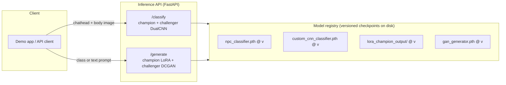

# Model Operations

Deployment architecture and maintenance plan for the two champion-challenger model pairs:

- **Problem 1 -- classification:** champion `DualCNN` (pretrained ResNet18 x2, `data/npc_classifier.pth`) vs. challenger `ScratchDualCNN` (from-scratch CNN x2, `data/custom_cnn_classifier.pth`)
- **Problem 2 -- generation:** champion LoRA/Stable Diffusion (`data/lora_champion_output/`) vs. challenger conditional DCGAN (`data/gan_generator.pth`)

---

## 1. Deployment architecture

**Serving split, by resource profile:**

| Model | Params | Checkpoint size | Measured latency | Suggested host |
|---|---|---|---|---|
| Classification champion | 22.6M | 86.4MB | 1.26ms/image (GPU) | CPU is realistic too -- small enough that GPU isn't required for the classify endpoint |
| Classification challenger | 3.4M | 13.0MB | 0.95ms/image (GPU) | CPU |
| Generation champion (LoRA) | SD1.5 backbone + rank-8 adapter | ~2GB (fp16 base + tiny adapter) | ~25 denoising steps/image | GPU worker -- this is the one endpoint that actually needs one |
| Generation challenger (DCGAN) | 13.6M generator | tens of MB | single forward pass, near-instant | CPU is plausible for low QPS |

Concretely: a single FastAPI process with two routes (`/classify`, `/generate`), each loading champion *and* challenger checkpoints at startup so both can be queried side by side (this is exactly what `python/demo_app.py` does locally, minus the HTTP layer). The `/generate` route is the only one with a real case for a GPU-backed worker; `/classify` is cheap enough to run anywhere. In a small-scale deployment both routes can live in one process; at higher load, split `/generate` into its own GPU-backed service so a burst of image-generation requests doesn't starve classification latency.

**Versioning:** each checkpoint directory/file is paired with a small `metrics.json` (test accuracy/F1 for classifiers, FID/CLIP-score for generators, the git commit hash of the training notebook that produced it, and the data snapshot date). This repo doesn't have that written yet, but it's a one-line addition wherever `torch.save(...)` happens in `03a`/`03b`/`07`/`08`.

---

## 2. Maintenance & parameter-update plan

**Why models here go stale:** OSRS ships regular game updates that add new NPCs. `npc.csv` / the image folders are a snapshot from one scrape (`01_web_scrape_osrs_wiki.ipynb`); new NPCs -- possibly new classes entirely -- won't be represented until the data is refreshed and the models retrained.

**Update cycle:**

1. **Re-scrape** -- periodically (e.g. quarterly, or triggered off an OSRS major-update announcement) re-run `01_web_scrape_osrs_wiki.ipynb` to pull newly added NPC pages/images.
2. **QA new data** -- reuse the existing human-in-the-loop pattern already in this repo: `flag_junk_images.ipynb` (CLIP-based candidate flagging) + `review_app.py` (Streamlit one-by-one review) before any new images enter a training set. Same idea applies to sanity-checking new captions for the generation pipeline.
3. **Retrain challengers, not champions, first** -- retrain both problems' *challenger* architectures on the refreshed dataset (cheaper: the from-scratch CNN trains in minutes, the DCGAN in similar time; the LoRA champion retrain is the most expensive step at ~7 minutes for 2,000 steps locally). Evaluate the retrained challenger against the *current production champion* on a freshly held-out test split.
4. **Promotion rule** -- a retrained model only replaces the current production model if it beats it on the primary metric on the new held-out split: test accuracy/macro-F1 for classification, FID + CLIP-score for generation. This is the same champion-challenger framing used throughout this project, just applied continuously instead of once.
5. **Rollback** -- keep at least the previous two promoted checkpoints per model. If a newly promoted model regresses in production (e.g. spot-checked generations look worse, or classification confidence on known NPCs drops), revert to the prior checkpoint -- this is why checkpoints are versioned rather than overwritten in place.

**Monitoring signals worth tracking in production**, even at small scale:
- Classification: prediction class distribution over time -- a sustained drift toward "Other" suggests new NPC types the top-10 label scheme doesn't cover, which is itself a signal to revisit `TOP_CLASSES` before the next retrain.
- Generation: periodic FID/CLIP-score spot checks (same method as `09_eval_image_generation.ipynb`) against a small fresh real-image sample, so quality regressions are caught before they reach users rather than discovered anecdotally.

**Parameter update triggers, summarized:** new data volume crosses a threshold (e.g. 100+ new NPCs) OR a scheduled quarterly check-in OR a monitored metric regresses -- whichever comes first.
